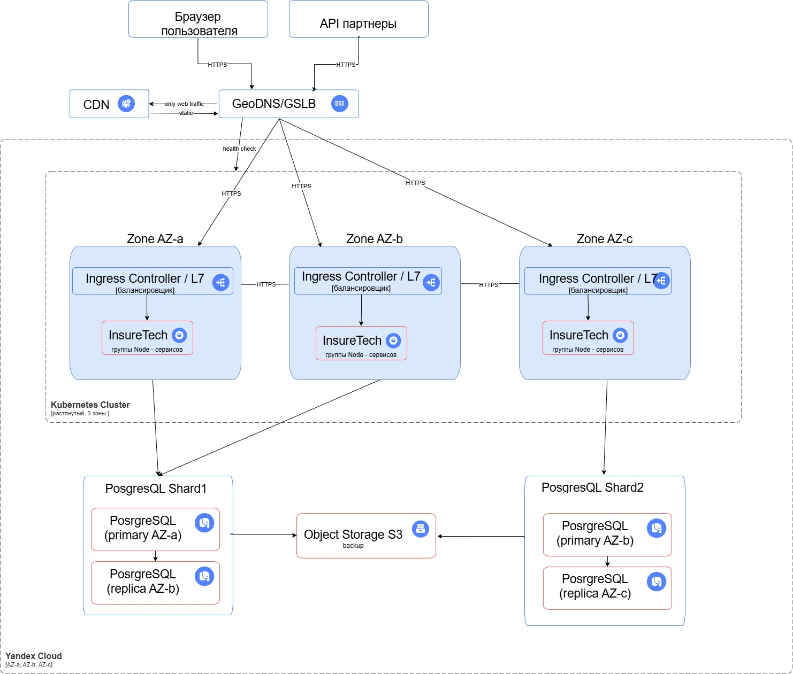

## Обеспечить
- RTO — 45 мин
- RPO — 15 мин. 
- Доступность 99,9%
- CDN
- Storage - ~50Gb
- Одинаковое время загрузки страницы

### 1. Определите стратегию масштабирования и отказоустойчивости.
- масштабирование
  - горизонтальное в Kubernetes (HPA - сколько копий приложений)
    - по CPU/RAM, по детализации
  - Автомасштабирование кластера по нодам (обеспечение количества серверов под копии)
    - Cluster Autoscaler
  - Размещение реплик по разным зонам (anti-affinity)
    - при потере зоны, сервисы продолжали работать

- Отказоустойчивость и зоны
  - 3 зоны досутпности в Yandex Cloud
  - Кластер Кубернетеса один, объединяет ноды из 3 зон
  - 2-3 реплики для сервиса на разных зонах
  - одинаковое время загрузки страницы путем:
    - CDN - для статики веба
    - GeoDNS/GSLB - на входе как распределятор в ближайшую зону

### 2. Мультизонность
- из предыдущего пункта выбрана мультизонная конфигурация

#### 2.А. Конфигурация развёртывания Kubernetes
- Подход: один Kubernetes-cluster на 3 зоны (растянутый)
  - обоснование
    - единый контур для деплоя и эксплуатации (CI/CD, конфиги)
    - за разпределение реплик по зонам по средствам scheduler/affinity
    - единые политики
- workload - правила как приложение живет в кластере
  - по зоне
    - nodeSelector - ограничения для Пода на ноде с определнными свойствами
    - topologySpreadConstraints - правила равномерного распределения  по зонам/нодам
      - так как podAntiAffinity обеспечивает по разным зонам/нодам, но не по количеству на них
    - podAntiAffinity - не класть одинаковые поды рядом (по разным зонам, не на одну ноду)
  - для сервисов
    - readinessProbe - правила направления трафика (нода жива но не готова)
    - livenessProbe - следим жив/не жив, если нет перезапускаем/траффик не гоним
  - для критических сервисов
    - PDB (PodDisruptionBudget) - правила одновременного "убивания" node при обновлении, autoscaller

#### 2.B. Балансировка 
- географический слой:
  - Глобальный вход - GeoDNS/GSLB направляет трафик в ближайшую зону (a/b/c YandexCloid)
- слой на уровне зоны:
  - L7 - Ingress Controller - распределение запроса по подам внутри Kubernetes-кластера
  - разные правила для входных мартшрутов -  web (CDN), API - напрямую
- слой проверки доступности:
  - GSLB/GeoDNS - учитывает доступность зон
  - L7 учитывает доступность сервисов (например, по ручку /health)
  - Kubernetes probes следит за:
    - Readiness - можно ли гнать траффик
    - Liveness - жив/не жив надо ли перезапустить

#### 2.C. Фейловер-стратегия
- Используем: Active-Active по зонам
  - все 3 зоны обслуживают трафик одновременно
  - при падении зоны трафик уходит в оставшиеся зоны через GeoDNS/GSLB
- Целевой эффект:
  - доступность 99.9% достигается переживанием отказа одной зоны без простоя сервиса

#### 2.D.Конфигурация БД
- PostgreSQL развёрнут в мультизональной конфигурации:
  - 2 шарда (Shard1, Shard2)
    - каждый шард имеет две реплики, каждая в разной зоне
- Failover БД:
  - автоматическое переключение Primary при отказе (Patroni)
  - RTO 45 минут выполняется за счёт автоматизации failover и готовых реплик
- RPO 15 минут:
  - репликация между зонами
  - резервное копирование и журналирование
- Резервное копирование:
  - регулярные full backup + WAL/инкрементальные
  - хранение в Object Storage (S3)

### 3. Шардирование БД
- применяется шардирование - 2 шарды
- Цели:
  - снять узкое место одного развернутого инстанса БД
  - повысить горизонтальную масштабируемость по данным
- Репликация:
  - у каждого шарда есть реплика в другой зоне
- Маршрутизация запросов:
  - по shard key на уровне приложения (например, client_id)
- На схеме отражены:
  - Shard1: Primary + Replica
  - Shard2: Primary + Replica
  - контур backup → Object Storage

### Структурная схема арзитектуры
- [structure.drawio](structure.drawio)
- 